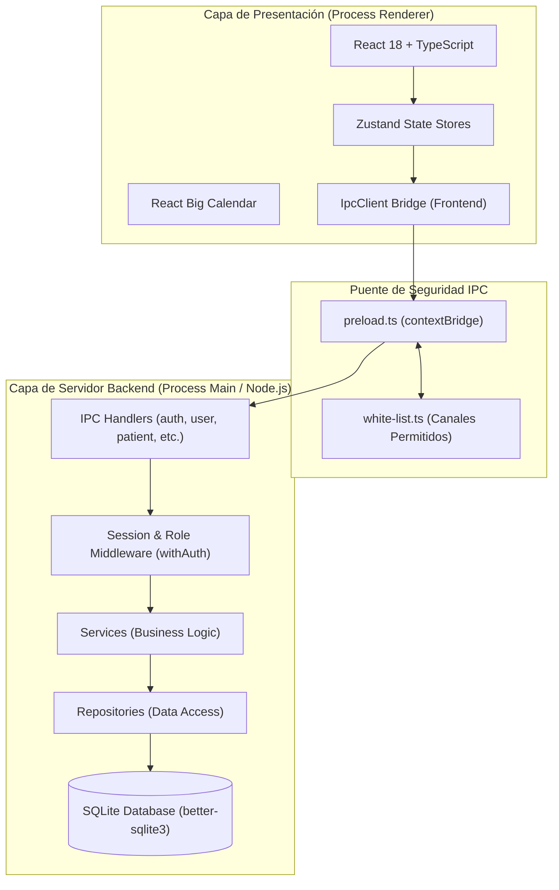

# Meraki - Sistema de Gestión Médica e Historias Clínicas

**Meraki** es una aplicación de escritorio multiplataforma desarrollada con **Electron**, **React**, **TypeScript** y **Node.js (embebido)**, diseñada para la gestión clínica integral, expedientes médicos, agendas de turnos y administración de personal en centros de salud.

---

## 🏛️ Arquitectura del Sistema

La arquitectura de Meraki sigue un enfoque de **Proceso Dual con Servidor Embebido (Embedded Node Engine)** y patrones de **Diseño Guiado por el Dominio (DDD)** con separación de responsabilidades en capas.



---

## 🔒 Capa de Seguridad IPC (Puente Seguro)

Para garantizar la máxima seguridad en aplicaciones Electron:

1. **Aislamiento de Contexto (`contextBridge`)**: El Frontend no tiene acceso directo a Node.js ni a la base de datos SQLite. Toda comunicación se canaliza a través de métodos expuestos de forma segura en [preload.ts](file:///home/antonio/Escritorio/apis/merakiNode/electron/preload.ts).
2. **Lista Blanca de Canales ([white-list.ts](file:///home/antonio/Escritorio/apis/merakiNode/electron/white-list.ts))**: El interceptor verifica que cada invocación pertenezca a la lista blanca de canales permitidos (`ALLOWED_INVOKE_CHANNELS`), bloqueando cualquier intento de inyección o canal no autorizado.
3. **Preload Estático**: El script de `preload` es 100% puro y liviano, evitando incluir dependencias de Node C++ (`better-sqlite3`, `argon2`) en el entorno restringido del navegador.

---

## 🧩 Módulos Principales de la Aplicación

### 🔑 1. Autenticación y Control de Acceso por Roles (RBAC)
- **Roles**:
  - `PROPIETARIO`: Acceso total a la administración, configuración inicial y supervisión clínica/agenda.
  - `PROFESIONAL`: Acceso a expedientes de pacientes, carga de evoluciones clínicas, diagnósticos, tratamientos y gestión de su agenda personal.
  - `SECRETARIO`: Gestión de pacientes (alta/edición), búsqueda y agendamiento de turnos para cualquier profesional del centro.
- **Sesiones**: Almacenamiento seguro de sesiones persistentes respaldadas por SQLite.

### 👥 2. Gestión de Usuarios y Personal
- Registro de profesionales y secretarios.
- Actualización de perfil, cambio de contraseñas con encriptación **Argon2**.
- Borrado lógico (*Soft Delete*) de usuarios para preservar el historial de auditoría.

### 🩺 3. Expediente de Pacientes y Relaciones de Tutores
- Registro completo de pacientes adultos y menores de edad.
- Vínculo de tutores/guardians con tipos de relación y contacto primario.
- Búsqueda SQL de alto rendimiento por nombre, apellido o DNI.

### 📜 4. Historia Clínica Integrada (Evoluciones, Diagnósticos y Tratamientos)
- Registro de evoluciones de consultas (`history_entry`) firmadas digitalmente por el profesional.
- Diagnósticos activos, crónicos y resueltos (`diagnosis`).
- Planes de tratamiento vinculados a evoluciones (`treatment`).
- Consolidación del expediente clínico completo (`history:getFull`) con línea de tiempo cronológica y múltiples profesionales.

### 📅 5. Gestión de Turnos y Agenda Médica (Appointments)
- **Calendario Interactivo**: Visualización reactiva en franjas de 30 minutos ([GeneralCalendar.tsx](file:///home/antonio/Escritorio/apis/merakiNode/src/private/features/calendar/GeneralCalendar.tsx)).
- **Código de Colores Dinámico**:
  - 🟢 **Verde** (`CONFIRMED`): Turno confirmado.
  - 🟡 **Amarillo** (`PENDING`): Turno pendiente.
  - 🔵 **Azul** (`COMPLETED`): Consulta finalizada.
  - 🔴 **Rojo** (`CANCELLED`): Turno cancelado (tachado y con franja horaria disponible para sobreescritura).
- **Protección Anti-Solapamiento**:
  - **Backend**: Verificación SQL estricta que impide agendar dos turnos activos en el mismo horario para un mismo profesional.
  - **Frontend UX**: Advertencia en tiempo real y deshabilitación del botón de envío si se detecta un conflicto de horario.

### 📊 6. Sistema de Logs y Auditoría
- Servicio de logging persistente en SQLite ([LoggerServiceSqlite.ts](file:///home/antonio/Escritorio/apis/merakiNode/electron/server/Configs/Logger/LoggerServiceSqlite.ts)).
- Filtrado por nivel (`INFO`, `WARN`, `ERROR`), exportación y rotación.

---

## 🛠️ Stack Tecnológico

| Capa | Tecnología |
|---|---|
| **Contenedor Desktop** | [Electron v33+](https://www.electronjs.org/) |
| **Frontend Framework** | [React 18](https://react.dev/) + [TypeScript](https://www.typescriptlang.org/) |
| **Bundler & Build Tool** | [Vite](https://vitejs.dev/) |
| **Estado Global** | [Zustand](https://zustand-demo.pmnd.rs/) |
| **Estilos & Componentes UI** | Bootstrap 5 + [React-Bootstrap](https://react-bootstrap.github.io/) + Sass/SCSS (Dart Sass) + [React Big Calendar](https://github.com/jquense/react-big-calendar) |
| **Motor de Base de Datos** | [Better-SQLite3](https://github.com/WiseLibs/better-sqlite3) |
| **Encriptación de Claves** | [Argon2](https://github.com/ranisalt/node-argon2) |
| **Validación de Esquemas** | `req-valid-express` |
| **Framework de Testing** | [Vitest](https://vitest.dev/) |

---

## 🚀 Comandos del Proyecto

### Desarrollo Local
Para iniciar la aplicación en modo desarrollo con recarga en caliente (*Hot Reload*):
```bash
npm run dev
```

### Ejecución de Pruebas Integradas / E2E
Ejecuta la suite completa de integración de servidor en entorno secuencial aislado:
```bash
npm run test:e2e
```

### Verificación de Tipos TypeScript (Build Check)
Verifica que no existan errores de compilación TypeScript en el proyecto:
```bash
npx tsc -p tsconfig.build.json --noEmit
```

### Compilación y Empaquetado para Producción
Compila el código TypeScript, empaqueta el frontend con Vite y genera los ejecutables de escritorio con Electron Builder:
```bash
npm run build
```

---

## 📁 Estructura del Proyecto

```
merakiNode/
├── electron/                   # Backend del Servidor y Proceso Main
│   ├── main.ts                 # Punto de entrada de Electron
│   ├── preload.ts              # Puente IPC seguro (contextBridge)
│   ├── white-list.ts           # Canales IPC autorizados
│   └── server/                 # Arquitectura de Servidor Embebido
│       ├── index.server.ts     # Registro central de módulos IPC
│       ├── Configs/            # DB, Logger y Manejo de Errores
│       ├── Features/           # Módulos DDD (auth, user, patient, diagnosis, treatment, appointments)
│       ├── ipc/                # Controladores de Canales IPC
│       ├── Schema/             # Tablas SQL y migraciones
│       └── server.e2e.test.ts  # Test suite E2E / Integración
├── src/                        # Frontend (React Renderer Process)
│   ├── context/                # Contextos globales (AuthContext)
│   ├── pages/                  # Vistas principales (Login, etc.)
│   ├── private/features/       # Componentes por módulo (calendar, history, patient, user, workspace)
│   └── shared/                 # API client, tipos y componentes compartidos
├── package.json
├── tsconfig.json               # Configuración TypeScript DX
├── tsconfig.build.json         # Configuración TypeScript Producción
└── vite.config.ts              # Configuración Vite + Electron Plugin
```

---

## 📄 Licencia

Desarrollado para el Centro Integral **Meraki**. Todos los derechos reservados.